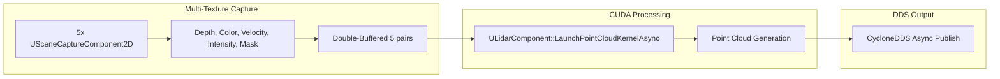
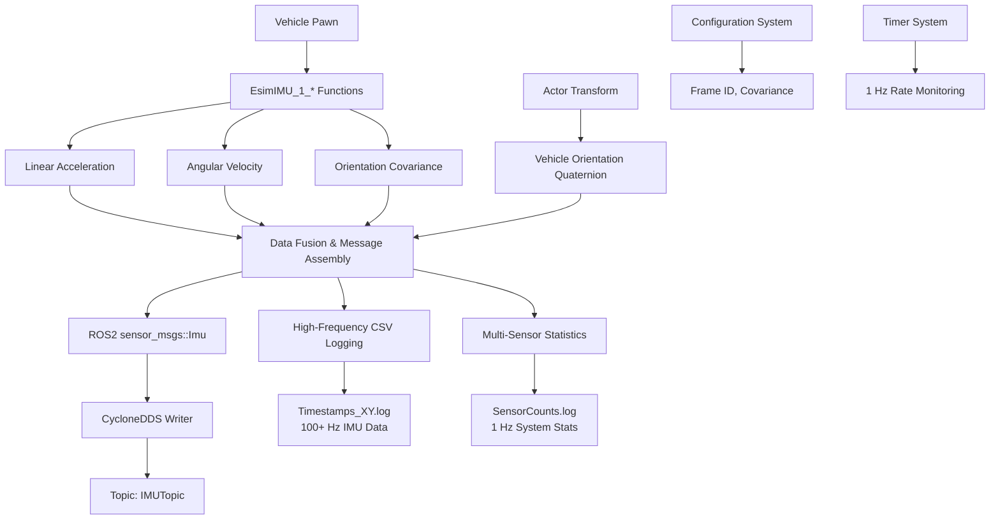

# **Front & Rear Perception System**  
## **Unreal Engine 5 – GPU-Accelerated Sensor Suite**  
> **Zero-Copy • Double-Buffered • Real-Time • CycloneDDS • CUDA**

---

## Table of Contents

- [Overview](#overview)
- [Feature Matrix](#feature-matrix)
- [Camera Pipeline](#camera-pipeline)
- [Lidar Pipeline](#lidar-pipeline)
- [IMU Pipeline](#imu-pipeline)
- [ESIM Config System](#esim-config-system)
- [System Components](#system-components)
- [Threading & Async Flow](#threading--async-flow)
- [Data Size](#data-size)
- [Configuration Panel](#configuration-panel)
- [Debug Output](#debug-output)
- [Quick Start Guide](#quick-start-guide)
- [Performance Highlights](#performance-highlights)

---

## Overview

A **fully GPU-accelerated**, **zero-CPU-copy**, **real-time** perception system for **front and rear** vehicle sensors in **Unreal Engine 5**.

**Key Capabilities:**
- **HDR camera processing** via HLSL compute shaders
- **Multi-layer Lidar point cloud generation** via CUDA kernels
- **High-frequency IMU publishing** via CycloneDDS
- **Double-buffered, asynchronous, real-time ready**

> **Note**: The Lidars and cameras **do not** have 360° coverage — each is **120° FOV**, front and rear only.

---

## Feature Matrix

| Feature | **Front Camera** | **Rear Camera** | **Front Lidar** | **Rear Lidar** | **IMU** |
|---------|:----------------:|:---------------:|:---------------:|:--------------:|:------:|
| **Sensor** | `USceneCaptureComponent2D` ×1 | `USceneCaptureComponent2D` ×1 | `USceneCaptureComponent2D` ×5 | `USceneCaptureComponent2D` ×5 | `EsimIMU_1_*` |
| **Processing** | **HLSL Compute Shader** | **HLSL Compute Shader** | **CUDA via `ULidarComponent`** | **CUDA via `ULidarComponent`** | **Blueprint + C++** |
| **Input** | HDR Float (RGBA32f) | HDR Float (RGBA32f) | Depth, Color, Velocity, Intensity, Mask | Depth, Color, Velocity, Intensity, Mask | Vehicle State |
| **Output** | BMP (with header) or BGR8 | BMP (with header) or BGR8 | ROS2 `PointCloud2` or Custom IDL | ROS2 `PointCloud2` or Custom IDL | `sensor_msgs::Imu` |
| **DDS Topic** | `rt/FrontCameraImageTopic` | `rt/RearCameraImageTopic` | `rt/front_pointcloud` | `rt/rear_pointcloud` | `IMUTopic` |
| **Double Buffer** | Yes (A/B) | Yes (A/B) | Yes (5 pairs) | Yes (5 pairs) | N/A |
| **Motion Blur** | Configurable | Configurable | Always On | Always On | — |
| **Weather Effects** | — | — | Rain/Fog Noise + Dropouts | Rain/Fog Noise + Dropouts | — |
| **Radial Velocity** | — | — | Yes | Yes | Angular & Linear |
| **Debug Save** | BMP/PNG | BMP/PNG | PLY + PNG | PLY + PNG | CSV Log |
| **Mode Switch** | `0`=BMP, `1`=BGR8 | `0`=BMP, `1`=BGR8 | `0`=Custom, `1`=ROS2 | `0`=Custom, `1`=ROS2 | — |
| **Coverage** | 120° FOV | 120° FOV | 120° FOV | 120° FOV | N/A |

---

## Camera Pipeline


### HLSL Compute Shader (`MainCS.usf`)

| Step | Operation | Details |
|------|-----------|---------|
| 1 | **Sample** | Bilinear HDR (`Texture2D<float4>`) |
| 2 | **Tone Map** | Exposure ×1.5 |
| 3 | **Gamma** | 1/2.2 |
| 4 | **Convert** | `float` → 8-bit BGR |
| 5 | **Error Handling** | NaN/Inf → Black |
| 6 | **BMP Header** | 54-byte (thread 0,0) |
| 7 | **Padding** | 4-byte row alignment |

> **Mode Switch**: `PerceptionMode = 0` → BMP, `1` → BGR8  
> **Zero CPU Copy** via `FRHIGPUBufferReadback`

### BMP Mode (`PerceptionMode = 0`)

- Full 54-byte header written **on GPU**
- Bottom-up row order (flipped Y)
- Row padding to 4-byte boundary
- No extra CPU allocation

---

## Lidar Pipeline



### `ULidarComponent` – CUDA Engine

| Feature | Implementation |
|---------|----------------|
| **Kernel Compilation** | `CompileAndLoadKernel()` via NVRTC + JIT |
| **Kernel Selection** | `depthToPointCloudParentKernelCustomIDL` or `Standard` |
| **External Memory** | D3D12 → CUDA via `cudaImportExternalMemory` |
| **Texture Binding** | `cudaTextureObject_t` (point sampling) |
| **Pinned Memory** | `cudaHostAlloc` for zero-copy |
| **Sync** | D3D12 Fence → CUDA Semaphore |
| **Compute Support** | Blackwell (`compute_120`) • Ada (`compute_89`) |

> **Runtime Compilation**  
> **Stream-based execution** for real-time performance

### Kernel Features

**Custom IDL Mode** (`PerceptionDefinitionMode = 0`):
- **5 floats per point**: X, Y, Z, Intensity, Radial Velocity
- **Velocity-based radial velocity calculation**
- **Weather-based point dropout simulation**

**ROS2 Mode** (`PerceptionDefinitionMode = 1`):
- **6 floats per point**: X, Y, Z, Intensity, Timestamp, Packed Color (RGB)
- **Color information from scene capture**
- **Standard PointCloud2 compatibility**

---

## IMU Pipeline



### **Core IMU Data Processing**

**Sensor Data Acquisition Pipeline:**
```cpp
// High-Frequency Motion Capture (100+ Hz)
FVector LinearAccel = UEsimBlueprintFunctionLibraryA::EsimIMU_1_LinearAcceleration(FVector::ZeroVector);
FVector AngularVel = UEsimBlueprintFunctionLibraryA::EsimIMU_1_AngularVelocity(FVector::ZeroVector);  
FVector4 Cov4 = UEsimBlueprintFunctionLibraryA::EsimIMU_1_OrientationCovariance(FVector4(0.0f, 0.0f, 0.0f, 0.0f));

// Vehicle Pose from Actor Transform
AActor* Vehicle = UGameplayStatics::GetPlayerPawn(GetWorld(), 0);
FQuat Quat = Vehicle ? Vehicle->GetActorQuat() : FQuat::Identity;
```

### **ROS2 Message Structure**

**Complete `sensor_msgs::Imu` Compliance:**

| Field | Type | Description | Source |
|-------|------|-------------|---------|
| **Header** | | | |
| `frame_id` | `string` | Configurable frame identifier | `IMUFrameId` config |
| `seq` | `uint32` | Auto-incrementing sequence | Internal counter |
| `stamp.sec` | `int32` | Unix timestamp seconds | `FDateTime::Now()` |
| `stamp.nanosec` | `uint32` | Nanosecond precision | Ticks calculation |
| **Orientation** | | | |
| `orientation.x/y/z/w` | `double` | Vehicle quaternion | Actor transform |
| `orientation_covariance[9]` | `double[9]` | Diagonal covariance matrix | Configurable |
| **Angular Velocity** | | | |
| `angular_velocity.x/y/z` | `double` | Radians per second | `EsimIMU_1_AngularVelocity` |
| `angular_velocity_covariance[9]` | `double[9]` | Zero (perfect measurement) | Hardcoded |
| **Linear Acceleration** | | | |
| `linear_acceleration.x/y/z` | `double` | Meters per second² | `EsimIMU_1_LinearAcceleration` |
| `linear_acceleration_covariance[9]` | `double[9]` | Zero (perfect measurement) | Hardcoded |

### **Advanced Features**

| Feature | Implementation | Details |
|---------|----------------|---------|
| **High-Frequency Publishing** | `TickComponent()` + Async Task | **100+ Hz** real-time updates |
| **Multi-Sensor Monitoring** | `LogSensorStats()` timer | Tracks all sensor rates |
| **Comprehensive Logging** | Dual CSV files | Raw data + system statistics |
| **Thread-Safe Operations** | `FScopeLock` + Mutex | Prevents file corruption |
| **Automatic Publisher Discovery** | `FindSensorPublishers()` | Dynamic sensor detection |
| **Backup System** | File rotation | Preserves previous logs |

### **Logging System**

**High-Frequency IMU Data (`Timestamps_XY.log`):**
```
Timestamp-day-time Accel_X Accel_Y Accel_Z AngVel_X AngVel_Y AngVel_Z Cov_X Cov_Y Cov_Z Cov_W Quat_W Quat_X Quat_Y Quat_Z SimTime
2024.11.26-14.30.25 1.234 -0.567 9.812 0.123 -0.045 0.067 0.001 0.001 0.001 0.000 0.707 0.000 0.707 0.000 125.467
```

**System Statistics (`SensorCounts.log`):**
```
Timestamp FrontLidarCount RearLidarCount FrontCameraCount RearCameraCount SimulationTime FrontLidarRate RearLidarRate FrontCameraRate RearCameraRate
2024.11.26-14.30.25 1245 1189 1567 1543 125.467 10.2 9.8 12.5 12.3
```

### **Performance Characteristics**

| Metric | Value | Impact |
|--------|-------|---------|
| **Publish Rate** | 100+ Hz | Real-time motion capture |
| **Message Size** | ~100 bytes | Minimal bandwidth |
| **Processing** | Async background | Zero game thread impact |
| **Logging Overhead** | <1% CPU | Optimized file I/O |
| **DDS Latency** | Sub-millisecond | Real-time ready |

---

## ESIM Config System


### Configuration Structure

| Category | Key | Type | Description |
|----------|-----|------|-------------|
| **Perception** | `FrontPerceptionMode` | `int32` | `0`=Off, `1`=On |
| | `RearPerceptionMode` | `int32` | `0`=Off, `1`=On |
| | `PerceptionDefinitionMode` | `int32` | `0`=Custom IDL, `1`=ROS2 |
| | `FlipPointCloudLeftRight` | `bool` | Mirror X-axis |
| **Camera** | `ResolutionX`, `ResolutionY` | `int32` | Image resolution |
| **Motion Blur** | `Enabled` | `bool` | Global motion blur |
| **IMU** | `IMUFrameId` | `FString` | ROS2 frame_id |
| | `OrientationCovarianceDiag` | `FVector` | Diagonal values |
| **Rig (base_link)** | `front_camera_link_loc/rot` | `FVector/FRotator` | Front camera pose |
| | `rear_camera_link_loc/rot` | `FVector/FRotator` | Rear camera pose |
| | `front_laser_link_loc/rot` | `FVector/FRotator` | Front Lidar pose |
| | `rear_laser_link_loc/rot` | `FVector/FRotator` | Rear Lidar pose |

---

## System Components

| Component | Role | Key Functions |
|-----------|------|---------------|
| `AFront_camera_publisher` | Front camera | `CaptureFrame`, `ProcessFrameGPU` |
| `ARear_camera_publisher` | Rear camera | `CaptureFrame`, `ProcessFrameGPU` |
| `AFront_lidar_publisher` | Front Lidar | `ProcessLidarFrame`, `PublishPointcloud` |
| `ARear_lidar_publisher` | Rear Lidar | `ProcessLidarFrame`, `PublishPointcloud` |
| `ULidarComponent` | **CUDA Engine** | `CompileAndLoadKernel`, `LaunchPointCloudKernelAsync` |
| `UKernelContainer` | Kernel manager | Stores source & entry points |
| `UDDSIMUPublisher` | **IMU + Stats** | `WriteDDS`, `LogSensorStats` |
| `UEsimConfigReaderSubsystem` | Config loader | YAML → `FEsimData`, spawn handling |

---

## Threading & Async Flow


> **Zero CPU memory copy**  
> **Fully asynchronous**  
> **CUDA Stream execution for Lidar**

---

## Data Size (1920×1080)

| Data | Size |
|------|------|
| **BGR8 Image** | **~6.22 MB** |
| **BMP (padded)** | **~6.25 MB** |
| **Point Cloud (per Lidar)** | **~1.84 MB** (76k points × 24 bytes) |
| **Dual Lidar Total** | **~3.68 MB** |
| **IMU Message** | **~100 bytes** |

---

## Configuration Panel

| Setting | Values | Effect |
|---------|--------|--------|
| `Front Perception Mode` | `0` = Off, `1` = On | Enable front sensors |
| `Rear Perception Mode` | `0` = Off, `1` = On | Enable rear sensors |
| `Perception Definition Mode` | `0` = Custom, `1` = ROS2 | Output format |
| `Flip Point Cloud Left Right` | `true` / `false` | Mirror X-axis |
| `MotionBlur.Enabled` | `true` / `false` | Add blur |
| `IMU Frame Id` | `FString` | ROS2 frame |
| `Orientation Covariance Diag` | `FVector` | IMU noise model |

---

## Debug Output

| Output | Format | Folder | Toggle |
|--------|--------|--------|--------|
| Front Camera | BMP/PNG | `SavedImages/` | `bDumpFrontImages` |
| Rear Camera | BMP/PNG | `SavedImages/` | `bDumpRearImages` |
| Front Depth | PNG | `SavedImages/` | `bDumpFrontDepth` |
| Rear Depth | PNG | `SavedImages/` | `bDumpRearDepth` |
| Front Point Cloud | PLY | `PointClouds/` | `bDumpFrontPLY` |
| Rear Point Cloud | PLY | `PointClouds/` | `bDumpRearPLY` |
| **IMU Log** | CSV | `Log/Timestamps_XY.log` | Always |
| **Sensor Rates** | CSV | `Log/SensorCounts.log` | Always |

---

## Quick Start Guide

1. **Edit `vehicle_config.yml`:**
   ```yaml
   FrontPerceptionMode: 1
   RearPerceptionMode: 1
   PerceptionDefinitionMode: 1  # 0=Custom, 1=ROS2
   IMUFrameId: "imu_link"
   OrientationCovarianceDiag: [0.001, 0.001, 0.001]
   ```
2. **Launch in Unreal Engine 5**
3. **Listen to DDS Topics:**
   - `rt/FrontCameraImageTopic`
   - `rt/RearCameraImageTopic`
   - `rt/front_pointcloud`
   - `rt/rear_pointcloud`
   - `IMUTopic`
4. **View Debug Output:**
   - Images: `SavedImages/`
   - Point Clouds: `PointClouds/`
   - IMU Data: `Log/Timestamps_XY.log`
   - System Stats: `Log/SensorCounts.log`

---

## Performance Highlights

| Metric | Value |
|--------|-------|
| **GPU Only** | Yes |
| **CPU Copy** | 0 bytes |
| **Double Buffered** | Yes |
| **Async Publish** | Yes |
| **Real-Time Ready** | Yes |
| **IMU @ 100+ Hz** | Yes |
| **CUDA Streams** | Yes |

---

**Fully GPU-Driven. Zero CPU Bottleneck. Front & Rear Sensor Fusion.**  
*Last Updated: November 2025*
